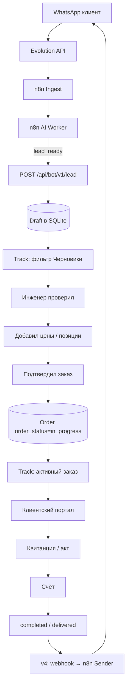

# FixariVan Bot ↔ CRM — спецификация интеграции

**Версия документа:** 1.0  
**Дата:** 2026-07-08  
**Статус:** Draft (контракт для согласования)  
**Системы:** FixariVan AI (n8n + Supabase + Evolution API) → fixarivan.space (PHP + SQLite)

### v1 — реализовано (`POST /api/bot/lead.php`)

| Поле | Значения | Track |
|---|---|---|
| `lead_state` | `received` → `analyzing` → `ready_for_review` | карточка только при `ready_for_review` |
| `priority` | `normal` / `high` / `urgent` (GPT) | бейдж Priority в фильтре «Требуют проверки» |
| CRM status | `lead_collecting` / `pending_review` | скрыто / видно |

Быстрый старт: `docs/BOT_API_QUICKSTART.md`

---

## 1. Цель и принципы

Интеграция связывает **WhatsApp-бота** с **CRM fixarivan.space** через HTTP API, без прямого доступа к SQLite из n8n.

**Принципы:**

1. **Событийная модель** — CRM вызывается не на каждое сообщение, а по «событию готовности лида».
2. **Draft-first** — бот создаёт черновик; инженер подтверждает и превращает его в полноценный заказ.
3. **Версионирование API** — путь и контракт рассчитаны на Telegram, Messenger, веб-чат, форму сайта.
4. **Идемпотентность** — один `whatsapp_chat_id` + `idempotency_key` не создают дубликаты.
5. **Телефон — ключ клиента** — сопоставление с `clients.phone` через `fixarivan_normalize_phone()` (Финляндия: `0…` → `358…`).

---

## 2. Архитектура

```
┌─────────────────┐     webhook      ┌──────────────┐
│  WhatsApp       │ ───────────────► │ Evolution API│
│  (клиент)       │                  └──────┬───────┘
└─────────────────┘                         │
                                            ▼
                                   ┌─────────────────┐
                                   │ n8n Workflow 1  │ Ingest
                                   │ → messages      │
                                   └────────┬────────┘
                                            ▼
                                   ┌─────────────────┐
                                   │ n8n Workflow 3  │ AI Worker
                                   │ chat_cards      │
                                   └────────┬────────┘
                                            │ HTTP (событие)
                                            ▼
┌──────────────────────────────────────────────────────────┐
│ fixarivan.space                                          │
│  POST /api/bot/v1/lead.php      — создать/обновить Draft  │
│  POST /api/bot/v2/lead.php      — расширенное обновление │
│  POST /api/bot/v3/lead/confirm  — Draft → Order          │
│  POST /api/bot/v4/webhooks/...  — обратные события CRM   │
│                                                          │
│  SQLite: clients, orders, documents                      │
│  UI: Track, order_new, client portal, invoice            │
└──────────────────────────────────────────────────────────┘
```

**Основная точка вызова (n8n):** после узла **Parse Response + Build SQL** в Workflow 3 (AI Worker), при выполнении условия триггера (см. §6).

**Дополнительная точка:** Workflow 7 (Service Quality) — `lost_lead` / `potential_followup` → тот же API с `event_type: lost_lead`.

---

## 3. Версии API (дорожная карта)

| Версия | Endpoint | Возможности | Срок (ориентир) |
|--------|----------|-------------|-------------------|
| **v1** | `POST /api/bot/v1/lead.php` | Создание Draft, upsert по chat_id, идемпотентность | MVP интеграции |
| **v2** | `PATCH /api/bot/v2/lead.php` | Обновление полей Draft (цена, срок, summary, stage) | +1–2 недели после v1 |
| **v3** | `POST /api/bot/v3/lead/confirm.php` | Конвертация Draft → Order (инженер или auto при `stage=confirmed`) | После стабилизации Track |
| **v4** | `POST /api/bot/v4/hooks/register.php` + CRM → n8n webhook | Обратные события: статус заказа, счёт, готовность | По необходимости |

**Заголовки (все версии):**

```http
Content-Type: application/json
X-FixariVan-Api-Key: <secret>
X-FixariVan-Api-Version: 1
X-Idempotency-Key: <uuid>   # опционально, рекомендуется
```

**Базовый URL (prod):** `https://fixarivan.space/api/bot/v1/lead.php`  
**Базовый URL (dev):** `http://localhost/fixarivan.space/api/bot/v1/lead.php`

---

## 4. Авторизация

| Механизм | Описание |
|----------|----------|
| `X-FixariVan-Api-Key` | Статический секрет, хранится в n8n Credentials и `business_rules` / env CRM |
| IP allowlist (опционально) | Только IP сервера n8n / Evolution |
| Rate limit | 60 req/min на ключ (рекомендация) |

**Ответ при ошибке авторизации:**

```json
{
  "success": false,
  "error": "unauthorized",
  "message": "Invalid or missing API key"
}
```

HTTP `401`.

---

## 5. v1 — Создание / upsert Draft

### 5.1 Метод и поведение

- **Метод:** `POST`
- **Поведение:** если заказ с `bot_whatsapp_chat_id` уже существует и `order_status = draft` → **обновить** (merge полей, не затирать непустые CRM-поля пустыми значениями из бота).
- Если заказ уже **подтверждён** (`order_status != draft`) → **не менять** бизнес-поля; только `bot_meta` (stage, summary) в `internal_comment` или отдельную JSON-колонку.

### 5.2 Тело запроса (JSON)

```json
{
  "event_type": "lead_ready",
  "idempotency_key": "550e8400-e29b-41d4-a716-446655440000",
  "source": {
    "channel": "whatsapp",
    "instance": "fixarivan6",
    "whatsapp_chat_id": "358401234567@s.whatsapp.net",
    "evolution_message_id": "3EB0C767F26DEECBB830"
  },
  "client": {
    "name": "Mika Virtanen",
    "phone": "+358 40 123 4567",
    "email": null,
    "language": "fi"
  },
  "device": {
    "type": "phone",
    "model": "iPhone 13 Pro",
    "serial": null
  },
  "request": {
    "problem_description": "Не заряжается, разъём расшатан",
    "service_type": "repair",
    "summary": "Клиент просит диагностику зарядки iPhone 13 Pro",
    "damage_type": "charging_port"
  },
  "ai": {
    "stage": "waiting_device",
    "client_intent": "repair_request",
    "lead_score": 72,
    "business_opportunity": true,
    "needs_owner_attention": false,
    "priority": "normal"
  },
  "bot_meta": {
    "supabase_chat_id": "uuid-chat",
    "last_bot_message_at": "2026-07-08T07:30:00+03:00"
  }
}
```

### 5.3 Поля запроса

#### Обязательные (создание Draft)

| Поле | Тип | Описание |
|------|-----|----------|
| `client.phone` | string | Телефон; нормализуется CRM |
| `client.name` | string | Имя (мин. 2 символа) |
| `request.problem_description` | string | Суть обращения (мин. 5 символов) |
| `source.channel` | enum | `whatsapp` \| `telegram` \| `web` \| `facebook` \| `manual` |
| `source.whatsapp_chat_id` | string | Уникальный ID чата (для WhatsApp) |

#### Рекомендуемые

| Поле | Тип | CRM-поле |
|------|-----|----------|
| `client.language` | `ru`\|`fi`\|`en` | `orders.language` |
| `device.type` | string | `orders.device_type` |
| `device.model` | string | `orders.device_model` |
| `ai.stage` | string | маппинг → `order_status` |
| `ai.priority` | `low`\|`normal`\|`high`\|`urgent` | `orders.priority` |
| `request.summary` | string | `internal_comment` (префикс `[Bot]`) |
| `request.service_type` | `repair`\|`sale`\|`custom` | `orders.order_type` |
| `idempotency_key` | uuid | защита от дублей |

#### Необязательные (v1 игнорирует или сохраняет как null)

| Поле | Комментарий |
|------|-------------|
| `client.email` | |
| `device.serial` | |
| `request.estimated_cost` | v2 |
| `request.expected_date` | v2 |
| `parts[]` | v2+ |
| `supplier` | v2+ |
| фото / media URLs | v2+ (`bot_media_json`) |

### 5.4 Ответ (успех)

```json
{
  "success": true,
  "api_version": 1,
  "draft": true,
  "created": true,
  "order_id": "ORD-20260708143000-A1B2C3D4",
  "order_row_id": 541,
  "document_id": "ORD-20260708143000-A1B2C3D4",
  "client_id": 218,
  "client_public_id": "CL-20260708143000-ABC123",
  "portal_token": "fv_xxxxxxxxxxxxxxxx",
  "portal_url": "https://fixarivan.space/client_portal.php?token=fv_xxxxxxxx",
  "status": "draft",
  "order_status": "draft",
  "public_status": "draft",
  "track_url": "https://fixarivan.space/track.html",
  "message": "Draft created"
}
```

**Повторный запрос (upsert):** `"created": false`, `"message": "Draft updated"`.

### 5.5 Ответ (ошибки)

| HTTP | error | Когда |
|------|-------|-------|
| 400 | `validation_error` | Нет phone/name/problem |
| 401 | `unauthorized` | Неверный API key |
| 409 | `conflict` | Заказ уже подтверждён, изменение запрещено |
| 422 | `invalid_stage` | Неизвестный ai.stage |
| 429 | `rate_limited` | Превышен лимит |
| 500 | `internal_error` | SQLite / сервер |

Пример:

```json
{
  "success": false,
  "error": "validation_error",
  "fields": {
    "client.phone": "required",
    "request.problem_description": "min_length_5"
  }
}
```

---

## 6. Условия вызова из n8n (триггер)

CRM **не вызывается**, если:

- `ai.stage` ∈ `greeting`, `collecting_info`, `smalltalk`, `unknown`
- `business_opportunity = false` **и** `needs_owner_attention = false`
- сообщение — эхо бота / тест владельца

CRM **вызывается**, если **любое**:

1. `business_opportunity = true` **и** `assistant_should_reply = true`
2. `needs_owner_attention = true`
3. `ai.stage` ∈ `waiting_device`, `waiting_parts`, `quote_ready`, `confirmed`
4. Service Quality: `status = lost_lead` → `event_type: lost_lead`

---

## 7. Таблица соответствия AI Stage → CRM

### 7.1 Stage → действие API

| AI Stage | Вызов API | CRM `order_status` | Видимость в Track |
|----------|-----------|-------------------|-------------------|
| `greeting` | ❌ нет | — | — |
| `collecting_info` | ❌ нет | — | — |
| `smalltalk` | ❌ нет | — | — |
| `waiting_device` | ✅ upsert Draft | `draft` | Черновик (скрыт/отдельный фильтр) |
| `waiting_parts` | ✅ upsert Draft | `draft` | Черновик |
| `quote_ready` | ✅ upsert Draft | `draft` | «Требует подтверждения» |
| `confirmed` | ✅ upsert + опц. v3 confirm | `in_progress` | Активный заказ |
| `in_progress` | ✅ update only | `in_progress` | В работе |
| `waiting_parts_active` | ✅ update | `waiting_parts` | Ожидает запчасть |
| `in_transit` | ✅ update | `in_transit` | В пути |
| `completed` | ✅ update | `done` | Готово |
| `delivered` | ✅ update | `delivered` | Выдано |
| `cancelled` | ✅ update | `cancelled` | Отменён |
| `lost_lead` (WF7) | ✅ create/update Draft | `draft` + flag | «Потерянный лид» |

### 7.2 Stage → legacy `orders.status`

| CRM order_status | orders.status (legacy) |
|------------------|------------------------|
| `draft` | `draft` |
| `in_progress` | `pending` |
| `waiting_parts` | `pending` |
| `done` | `completed` |
| `delivered` | `completed` |
| `cancelled` | `cancelled` |

> **Примечание:** сейчас в CRM `fixarivan_allowed_order_statuses()` не содержит `draft`. Добавление `draft` — **обязательная задача v1** (миграция SQLite + Track UI).

### 7.3 Маппинг `device.type` (бот → CRM)

| Бот | CRM `device_type` |
|-----|---------------------|
| `smartphone`, `phone` | `phone` |
| `tablet` | `tablet` |
| `laptop`, `pc`, `desktop` | `laptop` / `other` |
| `console` | `console` |
| `unknown` | `other` |

### 7.4 Маппинг `lead_score` → `priority`

| lead_score | priority |
|------------|----------|
| 0–39 | `low` |
| 40–69 | `normal` |
| 70–89 | `high` |
| 90–100 | `urgent` |

Переопределение: если бот передал `ai.priority` явно — использовать его.

---

## 8. Жизненный цикл Draft → Order



**Роли этапов:**

| Этап | Кто | CRM-действие |
|------|-----|--------------|
| Draft | Бот (auto) | API v1, не виден клиенту в портале как «активный ремонт» |
| Проверка | Инженер | Track / order_new — правки полей |
| Подтверждение | Инженер | v3 confirm **или** кнопка «Принять лид» в Track |
| Order | CRM | `order_status = in_progress`, документ заказа, token портала |
| Track | Инженер | статусы, запчасти, комментарии |
| Portal | Клиент | статус, документы, подпись |
| Invoice | Инженер | счёт, оплата |
| Completed | CRM | `done` / `delivered`, опционально сообщение бота |

---

## 9. Обязательные и необязательные поля

### 9.1 Создание Draft (v1)

| Поле | Обязательно |
|------|-------------|
| Телефон | ✅ |
| Имя | ✅ |
| Описание проблемы | ✅ |
| WhatsApp Chat ID | ✅ |
| Язык | рекомендуется |
| Тип устройства | ❌ |
| Модель | ❌ |
| Цена | ❌ |
| Срок | ❌ |
| Запчасти | ❌ |
| Поставщик | ❌ |
| Email | ❌ |

### 9.2 Поля, обновляемые в v2 (PATCH)

| Поле | Кто может менять |
|------|------------------|
| `public_estimated_cost` / цена | Бот (quote_ready), инженер |
| `public_expected_date` / срок | Бот, инженер |
| `order_lines_json` / запчасти | Только инженер (бот — не в v2) |
| `internal_comment` | Бот (summary), инженер |
| `public_comment` | Инженер |
| `language` | Бот, инженер |
| `order_status` / stage | Бот (по таблице §7), инженер |
| `priority` | Бот, инженер |
| `problem_description` | Бot (merge), инженер |

**Правило merge (бот):** новое непустое значение дополняет или заменяет только если CRM-поле пустое **или** источник = bot и `force_update: true`.

---

## 10. Защита от дублей

### 10.1 Ключи

| Ключ | Назначение |
|------|------------|
| `source.whatsapp_chat_id` | 1 активный Draft на чат |
| `idempotency_key` | Повтор того же HTTP-запроса → тот же ответ |
| `source.evolution_message_id` | Лог в `bot_events` (опционально) |

### 10.2 Алгоритм (v1)

1. Нормализовать телефон → найти/создать `clients`.
2. Найти заказ `WHERE bot_whatsapp_chat_id = ? AND order_status = 'draft'`.
3. Если найден → UPDATE (merge).
4. Если не найден → INSERT Draft + `bot_whatsapp_chat_id`.
5. Если есть **подтверждённый** заказ с тем же chat_id за последние N дней → `409 conflict` или привязка к существующему (настройка).

### 10.3 Новые колонки SQLite (v1 migration)

```sql
ALTER TABLE orders ADD COLUMN bot_whatsapp_chat_id TEXT;
ALTER TABLE orders ADD COLUMN bot_source_channel TEXT DEFAULT 'whatsapp';
ALTER TABLE orders ADD COLUMN bot_idempotency_key TEXT;
ALTER TABLE orders ADD COLUMN bot_ai_stage TEXT;
ALTER TABLE orders ADD COLUMN bot_meta_json TEXT;
CREATE UNIQUE INDEX idx_orders_bot_chat_draft
  ON orders(bot_whatsapp_chat_id)
  WHERE order_status = 'draft';
```

---

## 11. v3 — Draft → Order (confirm)

**Endpoint:** `POST /api/bot/v3/lead/confirm.php`

**Кто вызывает:** инженер (admin session) **или** n8n при `stage = confirmed` (если включено `auto_confirm: true` в business_rules).

**Запрос:**

```json
{
  "order_id": "ORD-20260708143000-A1B2C3D4",
  "confirmed_by": "engineer",
  "technician_name": "Sergeev Viacheslav",
  "place_of_acceptance": "Turku, Finland"
}
```

**Действия CRM:**

- `order_status` / `public_status`: `draft` → `in_progress`
- `date_of_acceptance` = сегодня
- создать документ типа `order` в `documents` (если ещё нет)
- Draft исчезает из фильтра «Черновики», появляется в активных Track

---

## 12. v4 — Webhook CRM → n8n

**Назначение:** при смене статуса заказа CRM шлёт событие в n8n → Workflow 5 (Sender) отправляет WhatsApp.

**Регистрация (CRM):**

```json
{
  "webhook_url": "https://n8n.example/webhook/fixarivan-crm-events",
  "secret": "hmac-shared-secret",
  "events": ["order.status_changed", "invoice.issued", "order.done"]
}
```

**Payload (CRM → n8n):**

```json
{
  "event": "order.status_changed",
  "order_id": "ORD-20260708143000-A1B2C3D4",
  "whatsapp_chat_id": "358401234567@s.whatsapp.net",
  "old_status": "in_progress",
  "new_status": "done",
  "client_language": "fi",
  "portal_url": "https://fixarivan.space/client_portal.php?token=..."
}
```

Подпись: `X-FixariVan-Signature: sha256=...`

---

## 13. Расширяемость каналов (будущее)

Единая модель `source.channel` позволяет без смены URL добавить:

| channel | ID-поле |
|---------|---------|
| `whatsapp` | `whatsapp_chat_id` |
| `telegram` | `telegram_chat_id` |
| `facebook` | `messenger_psid` |
| `web` | `web_session_id` |
| `manual` | null |

Endpoint остаётся `/api/bot/vN/lead.php` — «bot» = любой внешний автоматический канал.

---

## 14. План реализации

### Этап 0 — Согласование (текущий)
- [ ] Утвердить этот документ
- [ ] Утвердить таблицу Stage (§7)
- [ ] Сгенерировать API key

### Этап 1 — CRM v1 (Cursor)
- [ ] Миграция SQLite (§10.3)
- [ ] Добавить `draft` в `fixarivan_allowed_order_statuses()`
- [ ] `api/bot/v1/lead.php` + lib `bot_lead.php`
- [ ] Фильтр «Черновики из бота» в Track
- [ ] Хранение API key в `security_settings` / env

### Этап 2 — n8n (Claude)
- [ ] HTTP-узел после AI Worker с условием §6
- [ ] Маппинг `chat_cards.analysis` → JSON запроса §5.2
- [ ] Извлечение телефона из Evolution payload / GPT `extracted_phone` (предварительно — доработка бота)

### Этап 3 — CRM v2
- [ ] PATCH обновление Draft
- [ ] Merge-логика полей

### Этап 4 — CRM v3 + Track UI
- [ ] Кнопка «Принять лид» / confirm endpoint
- [ ] Auto-confirm по stage (опционально)

### Этап 5 — v4 webhooks
- [ ] Обратные события в n8n
- [ ] Шаблоны сообщений по языку клиента

---

## 15. Открытые вопросы (на согласование)

1. **Draft в Track:** отдельная вкладка или badge на карточке?
2. **Auto-confirm** при `stage=confirmed` или только ручное подтверждение инженером?
3. **Потерянные лиды (WF7):** создавать Draft или только задачу/уведомление в Telegram?
4. **Фото из WhatsApp:** сохранять URL в `bot_meta_json` в v1 или отложить?
5. **Один chat_id — несколько заказов:** разрешать историю или строго один Draft?

---

## 16. Changelog документа

| Версия | Дата | Изменения |
|--------|------|-----------|
| 1.0 | 2026-07-08 | Первая версия контракта |

---

*После утверждения документ является единственным источником правды для реализации CRM (Cursor) и n8n (Claude). Изменения — только через новую версию документа и semver API.*
